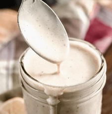

# Alabama White Sauce v1.0

## Ingredients

- [ ] 1 large egg, ROOM TEMPERATURE
- [ ] 1 tbsp dijon mustard
- [ ] 1/4 cup cider vinegar
- [ ] 1/2 tsp kosher salt
- [ ] 1 cup oil
- [ ] 1 tsp lemon juice
- [ ] 1 tbsp brown sugar
- [ ] 1 tsp prepared horseradish
- [ ] 1/2 tsp black pepper
- [ ] 1/4 cayenne pepper

## Instructions

1. Add egg to bowl and process for 20 seconds
1. Add mustard, vinegar, salt. Process for another 20 seconds.
1. Slowly add oil in drops while processing.
1. Add rest of ingredients and whisk together.

## Change Log

**v0.1**

- [Mayonnaise Recipe](https://www.inspiredtaste.net/25943/homemade-mayonnaise-recipe/)
- [Original Recipe](https://heygrillhey.com/alabama-white-sauce/)
