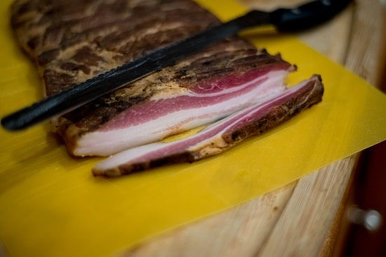

# BACON v0.1

## Brining

### Ingredients

- [ ] 15 lbs raw pork belly
- [ ] 3 tsp prague powder #1
- [ ] ¾ cp kosher salt
- [ ] 6 tbsp brown sugar
- [ ] 4 tbsp ground black pepper
- [ ] 3 tbsp granulated garlic
- [ ] 2 tbsp paprika
- [ ] 2 tbsp chili powder
- [ ] 6 cp water

Other
- [ ] 2-gal Ziploc bags

### Instructions

1. Mix ingredients in a bowl until fully dissolved.

2. Place meat and solution in bags and squeeze all air out.

3. Place bags in pan in a fridge for 7 days. Circulate cure liquid and flip bags once a day.

## Smoking

1. Take slabs out of bags and rinse thoroughly.

2. Smoke with wood chunks rather than chips at 200°F for 3-4 hours. Ensure meat's internal temperature reaches at least 150°F.

3. Refrigerate for several hours.

4. Slice against the grain

## Change Log

**v0.1**

* [Art of Manliness](https://www.artofmanliness.com/articles/how-to-make-your-own-bacon/)
* [Home is a Kitchen](https://homeisakitchen.com/2017/08/06/homemade-bacon-recipe-using-a-wet-cure-and-electric-smoker/)
