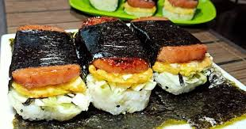

# MUSUBI  v2.0.0

## Ingredients

- [ ] 1 12 oz. can of low-sodium Spam™
- [ ] 3 cp cooked sushi rice
- [ ] seto fumi furikake (bonito)
- [ ] nori

### Teriyaki Sauce

- [ ] 3 tbsp soy sauce
- [ ] 4 tbsp mirin
- [ ] 1 tbsp oyster sauce
- [ ] 2 tsp sugar

### Eggs
- [ ] 5 eggs
- [ ] 2 oz milk

## Sesame Aioli
- [ ] 3 tbsp mayo
- [ ] 1 tsp sesame oil

## Instructions
1. Fry spam
1. Add sauce and bring to simmer
1. Assemble

## Change Log

**v1.0.0**

- [Original Recipe](https://www.jeanelleats.com/post/best-spam-musubi-recipe-how-to-make-homemade-hawaiian-spam-musubi-with-musubi-mold)

**v1.1.0**

- Double sauce serving size
- Butter for eggs
- Use low-sodium Spam™ to compensate for other ingredients
