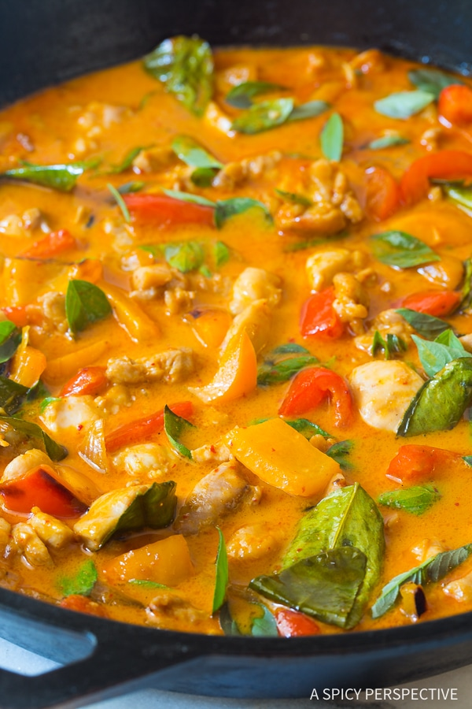

# PANANG THAI CURRY v1.0

## Ingredients

- [ ] 1 ½ pounds boneless skinless chicken thighs chopped
- [ ] 1 small onion, peeled and chopped
- [ ] 1 red bell pepper, seeded and chopped
- [ ] 1 orange bell pepper, seeded and chopped
- [ ] 2 garlic cloves, minced
- [ ] 1 tablespoon coconut oil
- [ ] 4 ounce can, Panang red curry paste
- [ ] 1 tablespoon peanut butter
- [ ] 12 , kaffir lime leaves, crushed
- [ ] 13.5 ounce can thick coconut milk, unsweetened
- [ ] 3 tablespoons fish sauce
- [ ] ¼ cup Thai basil leaves, or sweet basil

## Instructions

1. Cut the chicken into bite-size pieces. Chop the onions and peppers into rough 1 inch pieces. Mince the garlic. Then crush the kaffir lime leaves to help release their oils.
2. Place a 14 inch skillet (or wok) over medium-high heat. Add the coconut oil. Once the oil melts, add the onions. Sauté for 1 minute, then add the peppers and garlic. Sauté another 2-3 minutes.
3. Move the veggies to the sides of the skillet and add the panang red curry paste and peanut butter to the center of the pan. Sauté the curry for 2-3 minutes to intensify the flavor, moving around the pan. Then add the kaffir lime leaves, coconut milk, and fish sauce. Stir to blend.
4. Stir in the chopped chicken and bring to a boil. Lower the heat and simmer for 10-15 minutes, until the chicken is cooked through and the sauce thickens. Stir occasionally. Remove from heat and stir in the basil leaves. Serve with rice, quinoa, or noodles.

## Change Log

**v1.0**

* [Original Recipe](https://www.aspicyperspective.com/best-thai-panang-chicken-curry/)
